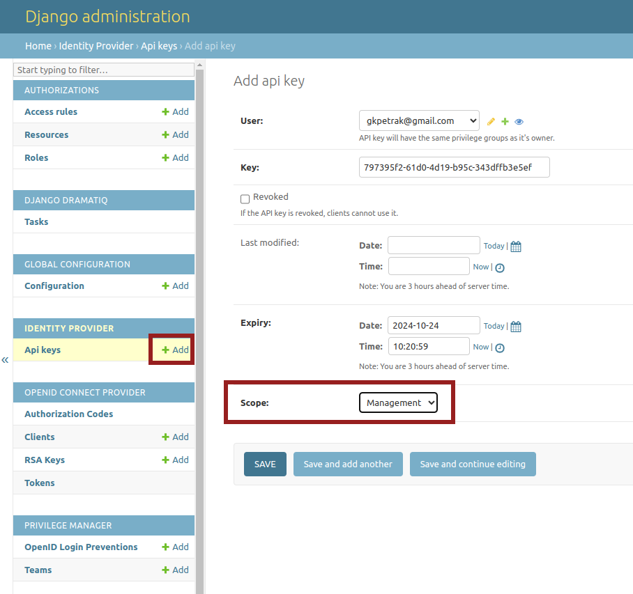

## API keys

DJAM as identity provider, uses API keys in order to manage and secure its internal functionality and the access to its clients, including a REST API for the API key management (for more information about REST API see [this section](/rest-api) ). More specifically, DJAM uses two types of keys:

* API key with the scope: `Resource`
* API key with the scope: `Management`

The API key with the scope `Resource` is used for the access to the clients' resources (e.g GeoServer) while the API Key with the scope: `Management` is used for the access to the DJAM REST API for the API key management.

Both types of API keys can be created using the DJAM administrator site (https://djam_domain/admin) selecting from the menu: `IDENTITY PROVIDER` >> `API keys` >> `add` icon.

In the `Add Api Key` form, the following fields have to be defined:

* the `user` who is the owner of the key
* The `API key` itself which is created automatically by DJAM
* the `revoked` status. If an API key is set to `revoked` by selecting the checkbox, the API key is considered inactive
* the `expiry` which is the expiration date of the key. If the key is expired cannot be used
* the `scope` of the API key in which the user is able to select between the scope `Resoure` and `Management` through a dropdown menu

It's worth noting that simple users are able to create only their own keys while superusers can create API keys for all the users.