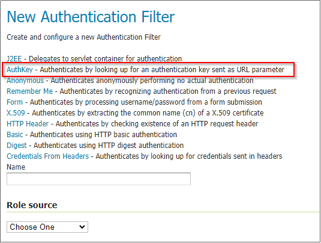
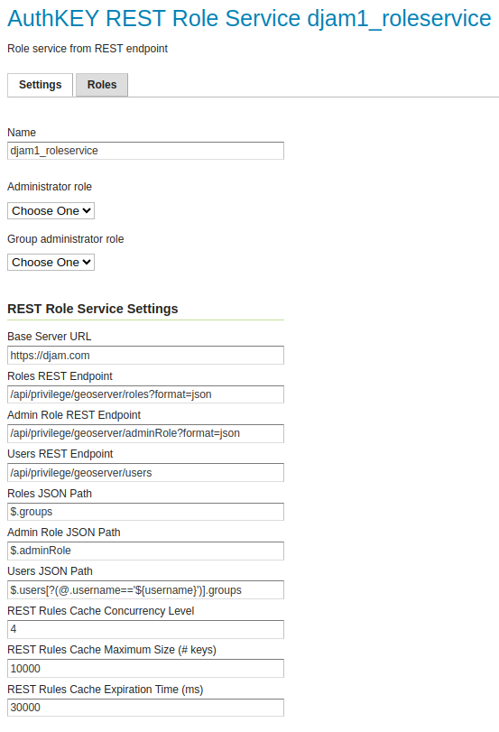
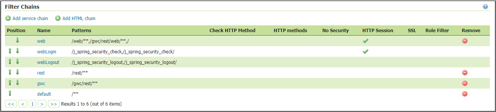
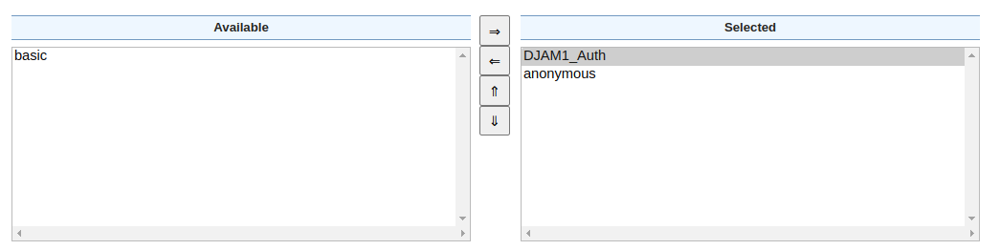
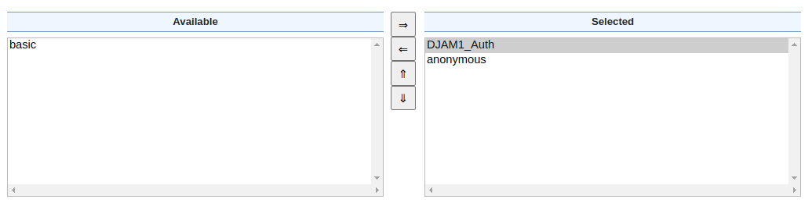

# Geoserver integration

In this section the configuration of GeoServer in order to be used with DJAM is presented. When GeoServer is used with DJAM, the authentication flow is described as below:

* A new Api Key with a specific user (and scope: Resource) is created through the DJAM admin site (as presented in the [Api keys section](/api-keys)) 
* A request containing the API Key is executed by the user. Example: `http://localhost:8080/geoserver/topp/wms?service=WMS&version=1.3.0&request=GetCapabilities&authkey=ef18d7e7-963b-470f-9230-c7f9de166888`
* Geoserver extracts the key from the request and asks DJAM to validate it
* If the key is valid (it’s not expired or revoked) DJAM will respond with the user associated to the key and, optionally, the list of groups (also known as DJAM Teams) the user is member of
* Geoserver will lookup its internal access rules to allow or deny the request

## DJAM teams and Geoserver roles

Administrators can create DJAM teams (user groups) in DJAM and users to them through the DJAM admin site. When GeoServer is configured to use DJAM, these teams will be automatically mapped to Geoserver roles while the mapping from DJAM teams to Geoserver roles allows creating Geoserver security rules to restrict access to resources based on the Geoserver role and therefore the DJAM team. In other words, administrators are able to manage the access to specific resources of GeoServer by assigning these resources to a GeoServer role (by creating a rule through the GeoServer UI) which is assiged with a specific DJAM team. Thus, all the users who are included in this DJAM team will be able to have access to these resources.

## GeoServer authkey module

For the GeoServer configuration in order to use DJAM, a vanilla GeoServer instance can be utilized while the `authkey` module of GeoServer is required. This module allows for a very simple authentication protocol designed for OGC clients. For these clients the module allows a minimal form of authentication by appending a unique key in the URL that is used as the sole authentication token. For more information please see the following [link](https://docs.geoserver.org/main/en/user/extensions/authkey/index.html). 

For the `authkey` module installation, follow the steps below:

* Download the `geoserver-2.23.2-authkey-plugin.zip` extension from the [GeoServer extensions archive](https://sourceforge.net/projects/geoserver/files/GeoServer/2.23.2/extensions/) 
* Unzip the content into the WEB-INF/lib folder of the GeoServer web application.
* Restart GeoServer
* From the GUI as administrator, go to “Security”, “Authentication” Clicking on “Add New Authentication Filter”. The `authkey` module should be available

## Protecting Resources through the Authentication Key module

##### Configure the Role Service

This is the service that is used by Geoserver to retrieve the list of roles (DJAM Teams). The list is updated each time the service is queried by the other Geoserver modules and services (Authentication filter, Data security, etc.) for the list of roles.

* From the GUI as administrator, go to “Security”, “Users, Groups, and Roles”
* Click “Add new” under Role Services
* Fill the fields according to the following image, with the USers JSON Path populated with: `$.users[?(@.username=='${username}')].groups`

##### Configure the User Groups Service

This service will be used by the Authentication Key Provider to map authenticated users and groups. 

* From the GUI as administrator, go to “Security”, “Users, Groups, and Roles”
* Click “Add new” under User Group Services 
* Fill the fields according to the following image, with the Web Search Response Roles Search Regualr expression populated with: `^.*?"groups"\s*:\s*\["([^"]+)"\].*$`
* Select the Role service created before

##### Configure the Authentication Key Provider

* From the GUI as administrator, go to “Security”, “Authentication”
* Clicking on “Add New Authentication Filter”, we should be able to see the module available
* Select `AuthKey`
* Provide a `Name` for the provider
* Change the name of the URL parameter to be used to identify the keys; the default one for DJAM is “authkey”, meaning that the requests will be in the form: `http://....?...&authkey=<the_user_key>`
* Select “Web Service” as authentication user mapper. This will configure Geoserver to use DJAM as the external authentication service. Fill in the values reported in the picture below.
* Fill the field “Web Service Response User Search Regular Expression”, with the following:  ^.*?\"username\"\s*:\s*\"([^\"]+)\".*$
* Select “djam_groupservice” (created before) as “User/Group Service”

#####  Adding the new authentication filter to the “Filter Chains”

The next step is to add the new authentication filter to the “Filter Chains”. "Filter Chains" exist in the same page as Authentication filters: “Security”, “Authentication”. Thus, from the panel of "Filter Chains" select `web`, `rest`, `gwc` and `default` accordingly, and move the new authentication filter on the right panel while the `basic` filter on the left panel as the following images: 

Web

REST

GWC

Default

**Note**: It is important to always “Save” all the changes. Click on all the “Save” buttons when finished updating the filters until back to the GeoServer home page. Double check that the configuration has been correctly saved.

## Protecting Workspaces and Layers

##### Verify the list of roles (DJAM Teams) are retrieved from Geoserver

* From the GUI as administrator, go to “Security”, “Users, Groups, and Roles”
* Switch to the “Roles” tab
* Click “djam_roleservice” to expand the list of available roles
* The list of DJAM Teams should appear, where the team name is prefixed with “ROLE_”

##### Create and manage the security rules

Last step is to protect the workspaces and layers for the specific roles by creating new rules. The logic on how those rules works is the following one:

* Apply the more generic rule
* Unless a specific one has been found

To create a new rule, select `new rule`, from the “Security”, “Data” section and then:

* select the workspace and its corresponding store 
* move the role that you created above (e.g ROLE_djam1) to the right panel (`selected roles`).
* save the new rule.

**NOTE**: The ROLES are derived by GeoServer automatically once a Users has added to a Group or assigned to a specific Role.

##### Access to the WMS service

Now the GeoServer is configured and can be tested by trying to access a protected layer with a user beloging to a specific team (for DJAM), or role (for GeoServer) (e.g DJAM_group1).

You can test by using a WMS GetMap query as the following:

http://localhost:8080/geoserver/<**workspace**>/wms?service=WMS&version=1.1.0&request=GetMap&layers=<**workspace**>%3A<**store**>&bbox=<**bbox coordinates**>&width=<**width in pixels**>&height=<**height in pixels**>&srs=EPSG%3A3857&styles=&format=application/openlayers&authkey=<**a valid resource key**>

If the resource key is valid (it is not expired or revoked), the layer should be displayed.

#### Basic Auth credentials validation
To be able to use Basic Auth authentication from in Geoserver with credentials vaildation in Djam [this](https://github.com/geosolutions-it/geoserver/issues/145) feature of Geoserver is required.

Another method of authenticating requests in Geoserver is User credentials validation by Djam. To do so you need to make a GET request to a view named
`user_credentials_introspection` with parameters `u` (user's username - by default it's their email) and `p` (user's password).

Generally, usage of this authentication method is discouraged. It should only be used in certain, controlled environments. When using this 
flow in a production environment, make sure `REQUIRE_SECURE_HTTP_FOR_GEOSERVER_INTROSPECTION` setting is `True` 
(djam/project/conf/prod/identity_provider.py).
