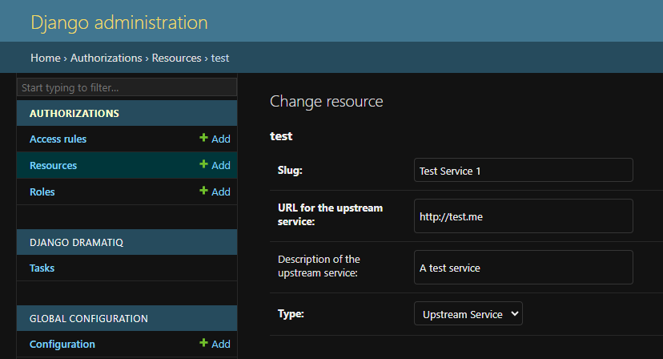
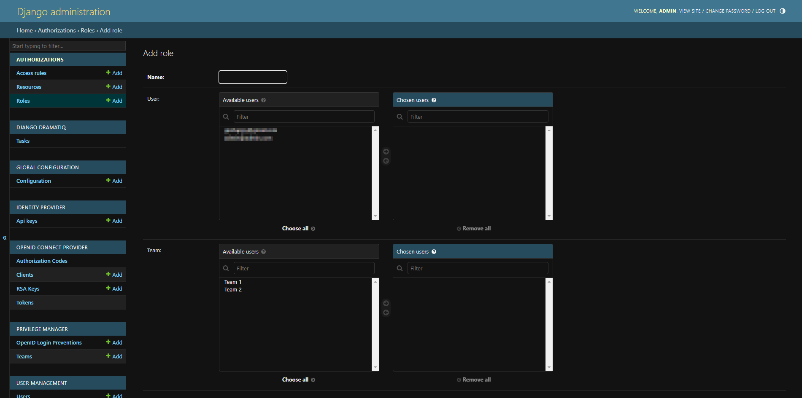
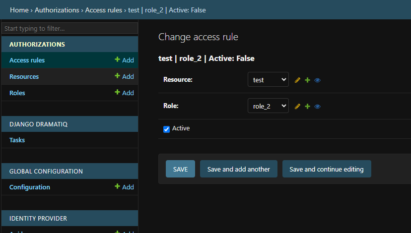

# Authenticated Proxy services

DJAM provides a proxy service that allows to expose upstream HTTP(S) endpoints behind authentication and authorization rules.

##Service configuration
An upstream service can be configured by creating a new `Resource` from the Django Admin.

A `Resource` for a proxied service consists of the URL to the upstream service, a name (`slug`), an optional description and the list of `Roles` (see below) allowed to perform requests to the service.

At the moment only "Upstream Service" resource types are supported, but this model is generic and can be used by new modules in the future and custom DJAM modules.

##Roles
`Roles` define a model to assign `Access Rules` to `Resources` ((in this case the upstream service)) to users and teams .

A `Role` can be created through the Django Admin.

##Access Rules
`Access Rules` assign `Roles` to `Resources`. Users and teams assigned to a role for which an access rule exists and is active for a resource, are allowed to access it.

An `Access Rule` can be created through the Django Admin.

