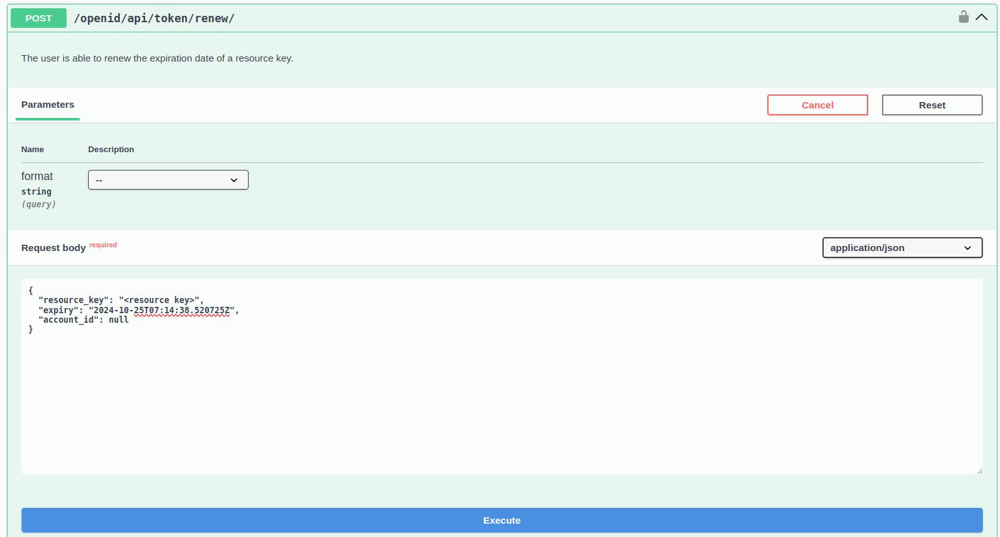

# REST API for API key management

As mentioned to the section `API keys`, DJAM allows to the users to have two types of API keys: 

* API keys with scope: Management. These keys are used for the access to the REST API which is described in this section
* API keys with scope: Resource. They are used for the access to the clients' resources (e.g GeoServer)

**Note**: For the sake of simplicity in this section the API keys with scope: Management will be called `management keys` and the API keys with scope: Resource will be called `resource keys`.

Each `resource key` includes two important parameters: (a) an expiration date (`expiry`) and (b) a `revoked` value which denotes if this resource key is active or not, while one user is able to have many resource keys. Thus, to facilitate the management of the resource keys, users are able to use a REST API in order to apply several operations in terms of API key management.

## Management operations of the API key management

The main operations for the API key management are described below:

* List: It outputs the list of a user's resource keys
* Create: It creates a new Api Key with `resource` scope
* Status: It returns the status of an Api Key, i.e. its revoked status and the expiration date
* Revoke: It modifies the `revoked` value of a resource key. When the `revoked` is defined as `True`, the corresponding API key is deactivated.
* Renew: The ApiKey expiration date is extended. The defined expiration date cannot exceed the max expiration period of six months. If the datetime is not defined, the ApiKey will be extended for 30 days.
* Rotate: The old ApiKey is revoked while a new ApiKey is created and returned to the user. The old API Key expiration date can be extended for three days more as a rollout time window by defining the `short_expiry` parameter as True.

It's worth noting that all the operations above can be applied as `POST` requests while they are developed in separated endpoints:

* List: Endpoint `/key_list`
* Create: Endpoint `/create_key`
* Status: Endpoint `/status`
* Revoke: Endpoint `/revoke`
* Renew: Endpoint `/renew`
* Rotate: Endpoint `/rotate`

## How to use of the REST API

The REST API can be used in two ways:

* By utilizing a tool for sending HTTP requests like cURL, PostMan, etc
* By using the API documentation which is a Swagger frontend

In both ways, a management key (a key with scope: `Management`) have to be defined in the `header`, in order to have access to the REST API with the following format: 

`Token <management key>` 

It's worth noting that as the resource keys, management keys have to be valid in terms of `expiration date` and the `revoked` value. 

Also, all the parameters which have to be defined are included inside the body of the request in a JSON format.

### CURL usage

If we want to use cURL in order to use the REST API, the following format should be followed:

```bash
curl -X POST -H "Authorization: Token <management key>" -H "Content-Type: application/json" -d '{"param1":"value1", "param2":"value2"}' http://<DJAM_domain>/openid/api/token/<API endpoint>/
```

### Swagger front-end usage

Another way to use the REST API is to use the Swagger front-end, in which each endpoint is included in a dropdown menu, where the user is able to define the parameters in a JSON format. It's worh noting that for a successful use of the API, users have to insert their `management key` (with the same format as above) by selecting the `padlock` icon on the right of each dropdown menu.


Each endpoint (in a dropdown menu) includes a short description while users are able to define the endpoint's parameters in a JSON format. By selecting the `Execute` button, the request will be performed.



### A note for the administrators / superusers

Although users are able to manage only their own resource keys, administrators / superusers are able to manage all the resource keys through this REST API. Thus, superusers are able to define the user / account for a specific operation that they have to perform by using a parameter called `account_id`. For instance, if a superuser wants to output the status of a resource key which is owned by a user with `ID=4`, superuser can run:

```bash
curl -X POST -H "Authorization: Token <management_key>" -H "Content-Type: application/json" -d '{"account_id":4, "resource_key":"<resource key>"}' http://<DJAM_domain>/openid/api/token/status/
```
It's worth noting that if the specified resource key is not owned by the user with the specified account, DJAM will not allowed the operation to be perfomed successfully.

## REST API endpoints

In this section, each API endpoint is described in detail with examples and expected results.

#### List

The user is able to export her/his keys with resource scope.

##### Parameters
For the simple users, there are no parameters in this endpoint except the parameter: `account_id` which can be used only by the superusers.

##### Example:
```bash
curl -X POST -H "Authorization: Token <management key>" -H "Content-Type: application/json" http://<DJAM_domain>/openid/api/token/key_list/
```

Expected results:
```json
{"tokens of george@gmail.com": [<key1>, <key2>, <key3>, ...]}
```
#### Create

The user is able to create a key with resource scope.

##### Parameters
* "revoked": "True or False"
* "expiry": "2024-10-25T07:14:38.520290Z",
* "account_id": null (for superusers)

None of the parameters are required. If the parameters are not defined in the request, DJAM will use their default values.

##### Example:
```bash
curl -X POST -H "Authorization: Token <management key>" -H "Content-Type: application/json" -d '{"revoked": "False"}' http://<DJAM_domain>/openid/api/token/create_key/
```

Expected results:
```json
{"username": "george@gmail.com", "token": "<new resource key>", "id": 131, "created": "success"}
```
#### Status

The user is able to export the status of a resource key.

##### Parameters
* "resource_key": "string"
* "account_id": null (for superusers)

The parameter `resource_key` is required since a valid resource key has to be defined.

##### Example:
```bash
curl -X POST -H "Authorization: Token <management key>" -H "Content-Type: application/json" -d '{"resource_key":"<resource key>"}' http://DJAM_domain/openid/api/token/status/
```

Expected results:
```json
{"username": "george@gmail.com", "key": "<resource key>", "id": 30, "revoked": true, "expiration date": "2024-10-14T09:36:00Z"}
```
#### Renew

The user is able to renew the expiration date of a resource key.

##### Parameters
* "resource_key": "string"
* "expiry": "2024-10-25T07:14:38.520725Z",
* "account_id": null (for superusers)

The parameter `resource_key` is required since a valid resource key has to be defined. If the expirition date is not defined a default expiration date of 30 days will be defined.

##### Example:
```bash
curl -X POST -H "Authorization: Token <management key>" -H "Content-Type: application/json" -d '{"resource_key":"<resource key>", "expiry": "2024-12-13T09:37:00.000Z"}' http://<DJAM_domain>/openid/api/token/renew/
```

Expected results:
```json
{"username": "george@gmail.com", "key": "<resource key>", "id": 48, "New expiration date": "2024-12-13T09:37:00Z"}
```
#### Revoke

The user is able to revoke her/his resource key

##### Parameters
* "resource_key": "string"
* "revoked": "True or False",
* "account_id": null (for superusers)

The parameters `resource_key` and `revoked` are required. If the `revoked` value is not defined a message: `Please set a revoked value` will be returned.

##### Example:
```bash
curl -X POST -H "Authorization: Token <management key>" -H "Content-Type: application/json" -d '{"resource_key":"<resource key>", "revoked": "True"}' http://<DJAM_domain>/openid/api/token/revoke/
```

Expected results:
```json
{"username": "george@gmail.com", "key": "<resource key>", "id": 48, "new revoked value": "True"}
```
#### Rotate

The user is able to revoke an old resource key and create a new one. Optionaly she/he can extend the expiration date of her/his old resource key for three days by setting the "short_expiry" to True.

##### Parameters
* "resource_key": "string"
* "short_expiry": "True or False",
* "account_id": null (for superusers)

The parameter `resource_key` is required since a valid resource key has to be defined. If the `short_expiry` value is not defined, the False value will be defined by default.

##### Example:
```bash
curl -X POST -H "Authorization: Token <management key>" -H "Content-Type: application/json" -d '{"resource_key":"<resource key>", "short_expiry": "True"}' http://<DJAM_domain>/openid/api/token/rotate/
```

Expected results:
```json
{"message": "The old key: <resource key> with id: 48 is revoked and extended for 3 days", "username": "george@gmail.com", "new_key": "<new resource key>", "id": 132}
```

## Authentication / Authorization

DJAM includes authentication and authorization functionality in order to manage and control the access to the REST API and as a consequence, to the clients' resources.

In this section, the main authentication and authorization constraints are presented including the expected results.

### Authentication

As mentioned above, the users are able to access the REST API by using a valid management key which is included in the header of the request.

When a request is performed DJAM performs the following checks in terms of management key's validity:

* Check if the management key exists in the header of the request. If it doesn't exist the following response will be returned:

```json
status code: 401 (Unauthorized)
 
{
  "detail": "Invalid token header. No credentials provided."
}
```

* If the key exists in the header, it checks if it is owned by a specific user. If no, the following response will be returned:

```json
status code: 401 (Unauthorized)
 
{
  "detail": "Invalid token."
}
```

* Check if the defined key is a key with scope: Resource.
If the key is not a management key but a resource key, the following response will be returned:

```json
status code: 401 (Unauthorized)
 
{
  "detail": "Invalid token."
}
```

* Check if the key is expired. If yes, the following response will be returned:

```json
status code: 401 (Unauthorized)
 
{
  "detail": "Permissions error: Your token as been expired. Please renew it !"
}
```

### Authorization

After the authentication of the user, DJAM has to test the user permissions, the validity of the resource key and the expiration date when the corresponding parameters are required.

#### Resource key verification

During a request which requres a resource key, DJAM peforms the following checks:

**Note** The resource key verification is not applied to the endpoints: /create_key and /key_list because these actions don’t require a resource key.

* If the user is superuser, DJAM checks if the specified user (by defining the `account_id`) owns the specified resource_key. If not, the following response will be returned:

```json
{"detail":"No access permissions or invalid resource key"}
```

* Check if the user which sends the request (the user is retrieved by the management key during authentication), owns the specified resource key. If not, or if the field is empty or incorrect, the following response will be returned:

```json
{"detail":"No access permissions or invalid resource key"}
```

* Check if the specified resource key is defined with the scope: `Resource`. If it is a management key, the following response will be returned:

```json
Status code: 403
{
  "detail": "No access permissions or invalid resource key"
}
```

#### Datetime verification

In the endpoints `/create_key` and `/renew`, the user is able to set an expiration datetime. Thus, DJAM performs a datetime verification which includes the following checks:

* Check, if a defined datetime is in the past. If yes, the following reponse will be returned:

```json
Status code: 403
{
  "detail": "Invalid format or expiration date."
}
```

* Check if the format of the datetime is incorrect. If yes, the following response will be returned:

```json
Status code: 403

{
  "detail": "Invalid format or expiration date."
}
```

* Check if the expiration datetime exceeds the 180 days. If yes, the following reponse will be returned:

```json
Status code: 403
{
  "detail": "Invalid format or expiration date."
}
```

