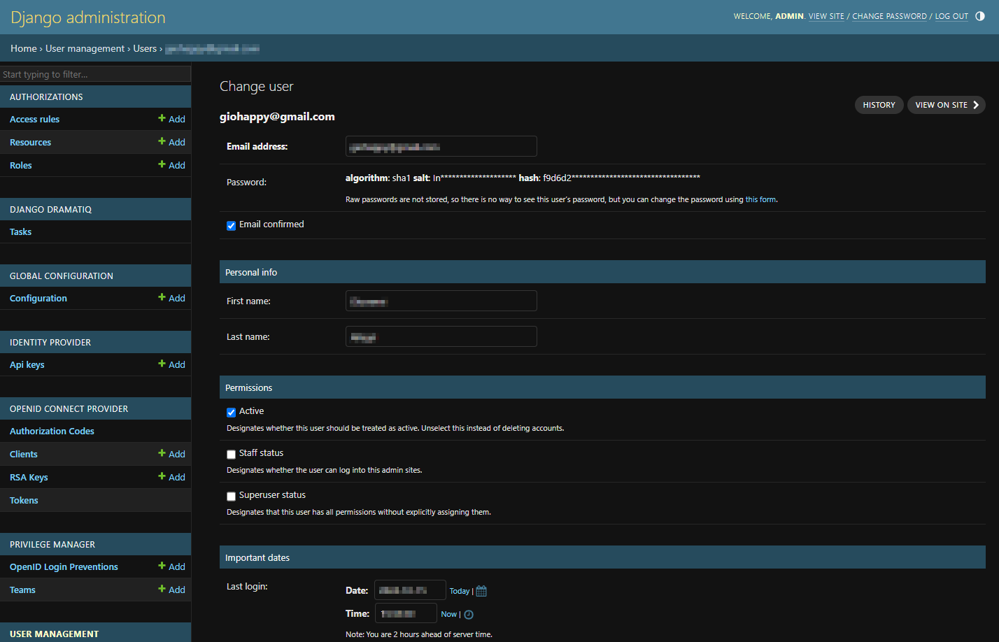
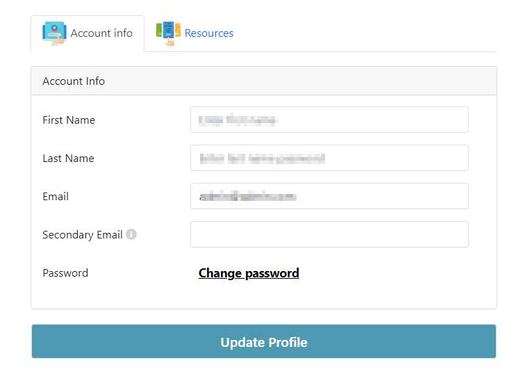
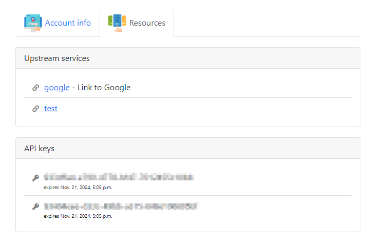
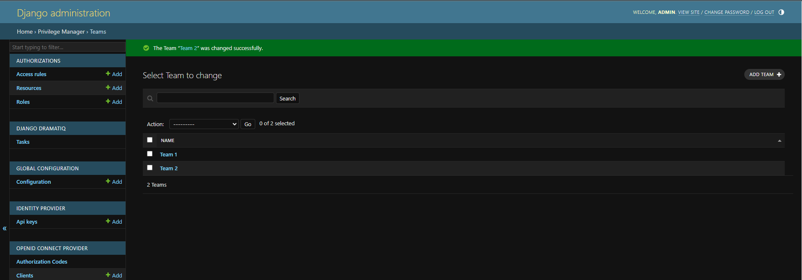

# Users and Teams

The following sections explain the two available models for DJAM accounts and their grouping in teams.

## Users
DJAM User is the model for the management of a DJAM account.
New accounts can be created from the Django Administration interface.
A username (email) and password are assigned to users to allow their authenticateìion with DJAM.

When users authenticate with DJAM they are redirected to theit Account page, which cointains basic account information.

If DJAM is configured to show the Resources tab, the list of active [API Keys](api-keys.md) and [proxy services](proxy.md) enabled for the user are listed.

## Teams
Teams allow to group user accounts. Groups are used by DJAM services for specific purposes: 

 - [Geoserver](integration-with-geoserver.md) Groups services can use users's teams to map users to its own groups and roles
 - Roles can be assigned to Teams to share access rules to [proxied services](proxy.md)

Teams can be managed from the Django Admin and users can be assigned to teams from Django Admin user management pages.

